<div align="center">

# ⋆｡˚ ☁︎ ˚｡⋆｡˚☽˚｡⋆ olá, eu sou a Sabrina ⋆｡˚☾˚｡⋆｡˚☁︎ ˚｡⋆

🌸 *desenvolvedora* 🌸

</div>

---

### ✿ sobre mim

```
🍡  trabalho com C# .NET/ Python / Java /
```

### ✿ aprendendo agora

```
📚  aprofundando em arquitetura de software e IA
🐳  Docker e deploy de aplicações
```

### ✿ tecnologias


### ✿ minhas estatísticas

<div align="center">




</div>

<div align="center">

### ✿ me encontre por aí

[](https://github.com/Sabrina632)
[](https://discord.com/users/)

</div>

<div align="center">

˗ˏˋ ꒰ obrigada por passar por aqui ꒱ ˎˊ˗ 🎀

</div>
